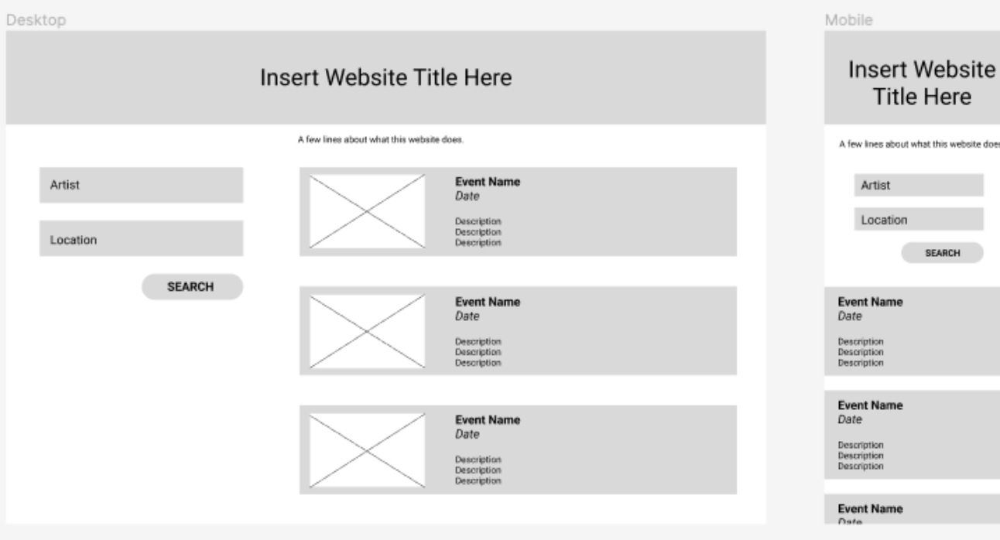

# chilly-mandrills' Musical Event Finder
## Description

The motivation behind this project is to work collaberatively to create an application that uses existing open server-side APIs to suggest live music events to attend based on the user's musical preference and location. This is a great opportunity to practice working collaberatively with other developers in creating an application that is built on taking advantage of the knowledge and creativity of every group member, as well as practicing fundamental coding skills.
***

## Table of Contents

- [Description](#description)
- [Usage](#usage)
- [Deployment](#deployment)
- [Credits](#credits)
- [License](#license)

***

## Installation

N/A
***
## Usage

As a user I want to search for music events around Australia based on the name of an artist and corrosponding genre, returning relevant information about upcoming events in a location (City) of the users choice.

WHEN I enter the name of my favourite artist and location of events, 
THEN a list of events relating to the users input (Artist) genre are displayed, relevant to location choice. 

WHEN I view the list of events I am given, 
THEN I am presented with all of the relevant information I will need to find events in a particular city. 

WHEN I click on an event that is displayed, 
THEN there is a link to [Ticketmaster](https://www.ticketmaster.com.au/) website for bookings and more information on that specific event. 
***

### Future Development
<li>Accomadation API and search results.</li>
<li>Expand Event API to include wider variety of events (regional and rural).</li>
<li>Add Weather API for more efficient trip planning.</li>
<li>Social media intergration.</li>

***

Screenshot:

## Deployment

(to be determined)
***

## Credits

This project was a group effort and is the culmination of efforts by Lily Hargreaves, Timothy Van Mook-Letcher, Michael Monaghan and Elaine Lim.
***
## License

Licensed under the MIT license.
***
